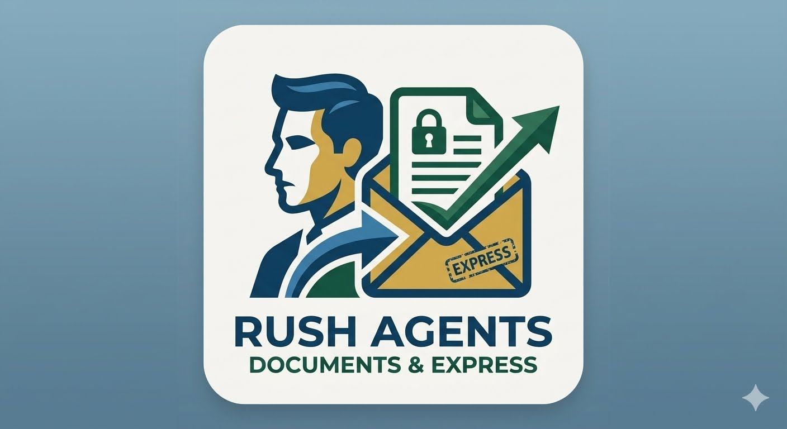

  

# WeeklyActivityReport
Weekly Activity Reports generated for management.

## What this does

This repo drives a Claude Code workflow that turns handwritten weekly work
notes (scanned to PDF) into finished status reports:

1. **Transcribe** the handwritten PDF verbatim into a typed Word document,
   flagging any unclear or illegible handwriting.
2. **Summarize** that transcription into an internal executive summary
   (key findings, follow-up items, anything needing confirmation).
3. **Format** a polished, submission-ready "Weekly SRE Update" Word report
   from the reviewed summary.
4. **Email** that report's content to a configured recipient, once the user
   confirms they've reviewed the document.

Each stage is a separate Claude Code skill under `.claude/skills/`, chained
together by the `handwritten-pdf-workflow` agent (`.claude/agents/`), so a
week's handwritten notes can go from scan to a reviewed, sent report with a
person checking the content at each step along the way.

## Source notes

The handwritten weekly notes that feed this workflow are taken on a
[Rocketbook](https://getrocketbook.com/) reusable smart notebook, then
scanned/exported to PDF for transcription.

  

